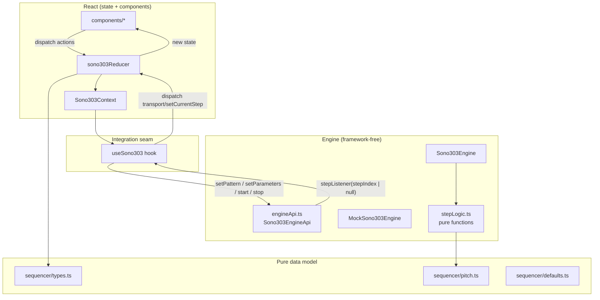
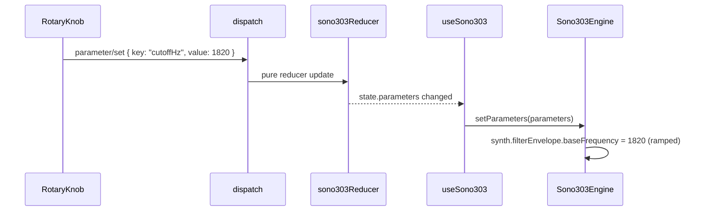
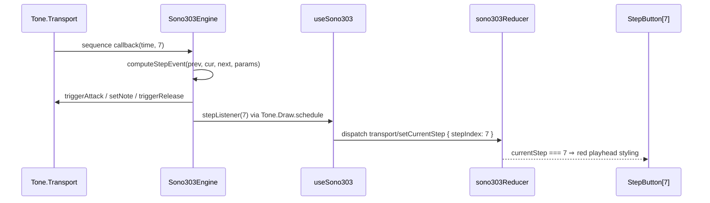

# SONO-303 Architecture

This document describes how the repository is organized and how its modules
interact. It is the companion to the product specification
([concept/TB303_ARCHITECTURE.md](../concept/TB303_ARCHITECTURE.md)) and the
engine contract ([ENGINE_API.md](ENGINE_API.md)).

## 1. Design goals

1. **The sound engine is UI-agnostic.** `src/audio/` is framework-free
   TypeScript. It never imports React and is importable from any host
   (React, vanilla TS, tests).
2. **The UI never touches Tone.js.** Components and state only dispatch
   serializable actions and read serializable state. The single integration
   point is `useSono303`.
3. **Musical decisions are pure functions.** Pitch math, slide detection,
   velocity, and release timing live in `src/audio/stepLogic.ts` and
   `src/sequencer/pitch.ts` — unit-testable without Web Audio.
4. **State is serializable.** Everything the UI knows lives in one
   `useReducer` state tree. No Tone.js objects, no class instances.

## 2. Repo map

```
sono-303/
├── concept/                    # Product spec + visual reference (read-only inputs)
│   ├── TB303_ARCHITECTURE.md   #   Authoritative product specification
│   ├── concept_art_sono303.png #   Visual target for Milestone 1
│   └── concept_art_2.png
├── docs/
│   ├── PLAN.md                 # Milestone plan (M0 docs → M1 UI → M2 engine)
│   ├── ARCHITECTURE.md         # This file
│   └── ENGINE_API.md           # UI-agnostic engine contract
├── AGENTS.md                   # Guidelines for agent contributors
├── src/
│   ├── audio/                  # Sound engine — NO React imports allowed
│   │   ├── engineApi.ts        #   Sono303EngineApi interface + factory type
│   │   ├── MockSono303Engine.ts#   Mock engine (M1 stand-in, zero Tone.js)
│   │   ├── Sono303Engine.ts    #   Real Tone.js engine (Milestone 2)
│   │   └── stepLogic.ts        #   Pure per-step musical decisions (M2)
│   ├── sequencer/              # Pure data model — NO React, NO Tone.js
│   │   ├── types.ts            #   Step, Pattern, SynthParameters, State, Action
│   │   ├── defaults.ts         #   Default parameters & 16-step pattern
│   │   └── pitch.ts            #   Pitch-class / octave / transpose math
│   ├── state/                  # React state layer
│   │   ├── sono303Reducer.ts   #   Pure reducer (serializable in/out)
│   │   └── Sono303Context.tsx  #   Provider + state/dispatch hooks
│   ├── hooks/
│   │   └── useSono303.ts       #   THE integration seam (engine ↔ reducer)
│   ├── components/             # Presentational React — dispatch only
│   │   ├── Sono303Panel.tsx    #   Four-zone instrument layout
│   │   ├── SoundControls.tsx   #   Zone 1: waveform + knobs
│   │   ├── TransportControls.tsx#  Zone 2: start/stop, mode, tempo, transpose
│   │   ├── StepSequencer.tsx   #   Zone 3: 16-step grid
│   │   ├── StepButton.tsx      #   One step button + A/S indicators
│   │   ├── StepEditor.tsx      #   Zone 4: selected-step editor
│   │   ├── MiniKeyboard.tsx    #   One-octave pitch selector
│   │   └── RotaryKnob.tsx      #   Accessible reusable knob
│   ├── styles/
│   │   ├── tokens.css          #   Design tokens (colors, radii, sizes)
│   │   └── sono303.css         #   Instrument-specific styling
│   ├── App.tsx                 #   Composition root
│   └── main.tsx                #   Entry: mounts App with provider
├── index.html
├── package.json
├── vite.config.ts
└── tsconfig*.json
```

## 3. Module boundaries



Rules:

- `src/components/*` imports from `src/state/*` and `src/sequencer/types.ts`
  only. **Never** from `src/audio/*` and **never** imports `tone`.
- `src/hooks/useSono303.ts` is the **only** file allowed to import both
  `src/audio/*` and the React layer.
- `src/audio/*` never imports React.
- `src/sequencer/*` imports neither React nor Tone.js.
- The reducer is a pure function: `(state, action) => state`, no side effects.

## 4. State model

```ts
// src/sequencer/types.ts (summary — see file for the canonical definitions)
type Sono303State = {
  mode: "play" | "write";            // independent from transport
  transport: "started" | "stopped";
  selectedStep: number;              // 0..15
  currentStep: number | null;        // playhead, null when stopped
  parameters: SynthParameters;       // 9 synth/transport values
  steps: Step[];                     // ALWAYS exactly 16
};
```

Invariants enforced by the reducer:

- `steps.length === 16` at all times.
- `selectedStep` clamped to `0..15`; `currentStep` is `null` or `0..15`.
- `envMod`, `accentAmount` clamped to `0..1`.
- Step octave clamped to `1..5`; transpose clamped to `±12`.
- Enabling REST resets `accent` and `slide` to `false` (no hidden state).
- Nothing non-serializable (Tone.js nodes, functions) ever enters state.

## 5. Action catalog

All reducer actions (`src/sequencer/types.ts`, `Sono303Action`):

| Action                        | Payload                    | Effect |
| ----------------------------- | -------------------------- | ------ |
| `transport/toggle`            | —                          | started ↔ stopped |
| `transport/setCurrentStep`    | `stepIndex: number \| null`| move/clear playhead |
| `mode/set`                    | `"play" \| "write"`        | switch mode (never touches transport) |
| `parameter/set`               | `key`, `value`             | set one `SynthParameters` field |
| `step/select`                 | `stepIndex`                | choose step 0..15 |
| `step/setPitch`               | `note: PitchClass`         | set note + `active = true` |
| `step/setRest`                | `rest: boolean`            | rest on/off; on ⇒ clears accent+slide |
| `step/changeOctave`           | `delta: -1 \| 1`           | clamp 1..5 |
| `step/toggleAccent`           | —                          | flip accent (no-op while rest) |
| `step/toggleSlide`            | —                          | flip slide (no-op while rest) |

Step-editing actions operate on `selectedStep`.

## 6. Data flow — two canonical paths

### Path A: "User drags the CUTOFF knob"



1. The knob computes a value and dispatches `parameter/set`.
2. Reducer returns new state; React re-renders.
3. `useSono303` observes `state.parameters` and calls `engine.setParameters`.
4. The engine applies short ramps for continuous parameters
   (`param.rampTo(next, 0.02)`). Discrete values (waveform) are assigned
   directly without ramping.

### Path B: "Transport plays step 7"



1. Tone.js Transport owns timing and fires the sequence callback.
2. The engine reads the **latest** pattern from a stable mutable reference —
   live edits need no sequence rebuild.
3. All musical decisions come from the pure `computeStepEvent` function.
4. The visual playhead is scheduled at audio time through `Tone.Draw`.
5. The engine's ONLY back-channel to the UI is `stepListener(stepIndex)`.

## 7. Milestone architecture status

| Layer                    | M0 | M1                         | M2                      |
| ------------------------ | -- | -------------------------- | ----------------------- |
| Docs                     | ✅ | —                          | updated                 |
| `sequencer/*`            | —  | pure data model            | + pitch tests           |
| `state/*`                | —  | reducer + context          | + reducer tests         |
| `audio/engineApi.ts`     | —  | interface defined          | unchanged               |
| Engine implementation    | —  | `MockSono303Engine` (timer)| `Sono303Engine` (Tone.js) ✅ |
| `audio/stepLogic.ts`     | —  | —                          | pure logic + tests ✅   |
| `components/*`           | —  | full four-zone UI          | unchanged               |
| `hooks/useSono303.ts`    | —  | wired to mock factory      | real engine factory ✅  |

The mock and the real engine implement the **same** `Sono303EngineApi`.
Milestone 2 changed nothing in `components/`, `state/`, or `sequencer/` —
only which factory `useSono303` uses by default. The mock remains in the
repo as a test/demo artifact and as a reference implementation of the
engine contract.
