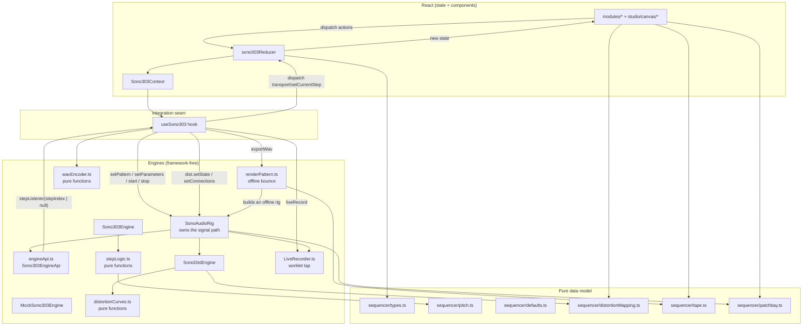
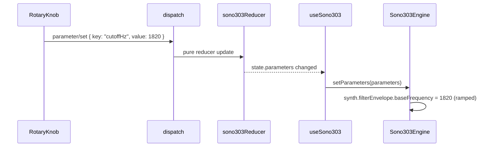
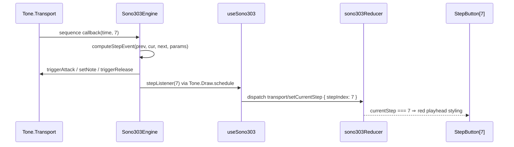

# SONO-303 Architecture

This document describes how the repository is organized and how its modules
interact. It is the companion to the product specification
([concept/TB303_ARCHITECTURE.md](../concept/TB303_ARCHITECTURE.md)) and the
engine contract ([ENGINE_API.md](ENGINE_API.md)).

## 1. Design goals

1. **The sound engine is UI-agnostic.** `src/core/audio/` is framework-free
   TypeScript. It never imports React and is importable from any host
   (React, vanilla TS, tests).
2. **The UI never touches Tone.js.** Components and state only dispatch
   serializable actions and read serializable state. The single integration
   point is `useSono303`.
3. **Musical decisions are pure functions.** Pitch math, slide detection,
   velocity, and release timing live in `src/core/audio/stepLogic.ts` and
   `src/core/sequencer/pitch.ts` — unit-testable without Web Audio.
4. **State is serializable.** Everything the UI knows lives in one
   `useReducer` state tree. No Tone.js objects, no class instances.

## 2. Repo map

```text
sono-303/
├── concept/                         # Product specs and visual references
├── docs/
│   ├── PLAN.md                      # Historical M0–M2 roadmap
│   ├── ARCHITECTURE.md               # Current boundaries and data flow
│   ├── ENGINE_API.md                 # Framework-free engine contracts
│   └── REORGANIZATION.md             # Migration map and core extraction
├── AGENTS.md
├── src/
│   ├── core/                        # Extractable; no React or studio imports
│   │   ├── README.md                # Dependencies and extraction instructions
│   │   ├── audio/                   # Engines, rig, recording, WAV, worklet
│   │   │   ├── Sono303Engine.ts
│   │   │   ├── SonoDistEngine.ts
│   │   │   ├── SonoAudioRig.ts
│   │   │   ├── engineApi.ts
│   │   │   ├── distEngineApi.ts
│   │   │   ├── MockSono303Engine.ts
│   │   │   ├── stepLogic.ts
│   │   │   ├── distortionCurves.ts
│   │   │   ├── LiveRecorder.ts
│   │   │   ├── tapProcessor.worklet.js
│   │   │   ├── renderPattern.ts
│   │   │   └── wavEncoder.ts
│   │   └── sequencer/               # Types, defaults, pitch, mappings, timing
│   ├── studio/
│   │   ├── audio/useSono303.ts       # Only React ↔ engine bridge
│   │   ├── state/                   # Reducers, contexts and state hooks
│   │   ├── input/                   # Note input, keyboard, MIDI and provider
│   │   ├── canvas/                  # Current fixed workbench and patchbay
│   │   │   ├── Workbench.tsx
│   │   │   ├── PatchBay.tsx
│   │   │   ├── patchBayContext.ts
│   │   │   └── JackSocket.tsx
│   │   └── styles/                  # Existing shared theme, unchanged cascade
│   ├── modules/
│   │   ├── sono303/                 # Instrument panel, controls and keyboard
│   │   ├── distortion/              # Effect panel and mode selector
│   │   ├── tape/                    # Recorder panel
│   │   └── shared/                  # Module chassis, RotaryKnob, knobScales
│   ├── App.tsx                      # Composition root and stylesheet imports
│   ├── main.tsx                     # Provider and entry point
│   └── vite-env.d.ts
├── package.json
├── vite.config.ts
└── tsconfig*.json
```

Tests stay next to the implementations they exercise. The directory named
`studio/canvas` currently contains the fixed workbench, not a React Flow
canvas. No output panel exists yet: the existing output and limiter remain in
`core/audio/SonoAudioRig.ts`. See [REORGANIZATION.md](REORGANIZATION.md) for
the planned follow-up boundaries.

## 3. Module boundaries



`distortionMapping.ts` sits in the pure data model rather than in `src/core/audio/`
precisely so both the effect engine and the knob readouts can use it without
breaking the components-never-import-audio rule. `tape.ts` is there for the
same reason: SONO-TAPE prints the bounce duration on the panel, and the
renderer needs the same number in samples.

### Offline export (SONO-TAPE)

The bounce reuses the entire instrument rather than re-implementing it. Nothing
in `src/core/audio/` captures an AudioContext at import time — every touchpoint goes
through `Tone.getContext()`, `getTransport()` or `getDestination()`, resolved
when called — so building a **fresh `SonoAudioRig` inside a `Tone.Offline`
callback** binds the whole graph to an `OfflineAudioContext`, and the rig's one
route to `Tone.getDestination()` becomes the route into the rendered buffer.

Three constraints fall out of that, all enforced in `renderPattern.ts`:

- **Never `setStepListener` on an offline engine.** The playhead callback goes
  through `Tone.getDraw()`, which schedules on `requestAnimationFrame`.
- **Pass the distortion state through the `SonoAudioRig` constructor**, never
  `dist.setState`. `SonoDistEngine.setMode` cross-fades an active-to-active
  voicing swap around a real `setTimeout`, which would fire after the render.
- **Hard-set `transport.bpm.value` after `setParameters`.** The 50 ms tempo ramp
  from Tone's default 120 integrates into a permanent phase offset that would
  pull the bounce off the DAW grid.

The file loops seamlessly because the render is deterministic and therefore
periodic once the parameter ramps settle: `s(t) === s(t + T)` for a pattern pass
`T`. One extra pass is rendered and discarded, and the kept slice is taken from
the settled region — so its last sample joins its first exactly as it did
mid-render, with the previous pass's decay tail already ringing at sample zero.

### Signal path and the patchbay

Exactly one route reaches `Tone.Destination`, and it is owned by
`SonoAudioRig`. Every module's output is a permanent bus, and the patchbay is
nothing but a set of gains between those buses:

```text
synth ─► dry ─┬─► dryToDist ──► dist ─► wet ─┬─► wetToMonitor ─┐
              ├─► dryToMonitor ──────────────────────────────┬─┴─► monitor ─► limiter(-1) ─► Destination
              └─► dryToTape ─┐               └─► wetToTape ─┐ │
                             └─────────────► tapeBus ◄─────┘
                                                └─► LiveRecorder (worklet tap, 0 outputs)
```

Every gain is derived from `state.connections` by `#applyRouting`. Nothing is
ever `connect`ed or `disconnect`ed while audio may be running, so repatching
cannot click. Inside `SonoDistEngine`, BYPASS is a real dry path through a
`Tone.CrossFade`, not a distortion turned down.

Two rules define what the cables mean:

- **You hear the end of the chain** — SONO-DIST when the instrument runs
  through it, the bare instrument otherwise, never both at once.
- **SONO-TAPE captures whatever is in its own IN.** Nothing plugged in means it
  genuinely records silence. It is deliberately allowed to differ from what you
  hear: recording dry while monitoring through the distortion is a real thing
  to want.

A jack holds exactly one cable. `src/core/sequencer/patchbay.ts` owns those rules as
pure functions; `PatchBay` draws one lead per connection from the same list, so
a drawn cable and a real one cannot disagree. Whether SONO-DIST is in the path
is never stored — it is `isDistPatched(connections)`.

Rules:

- Every device is built from `<Module>`: shell, screws, faceplate and jacks.
  A module declares its ports and its own controls, and never learns that
  cables exist — `PatchBay` measures the sockets and draws the leads.
- `src/modules/*` and `src/studio/canvas/*` use the studio contexts, input
  hooks and pure core data. **Never** import `src/core/audio/*` or `tone`.
- `src/core/*` never imports `src/studio/*` or `src/modules/*`.
- `src/studio/audio/useSono303.ts` is the **only** file allowed to import both
  `src/core/audio/*` and the React layer. It publishes a `NoteGate` through
  `NoteGateContext` and a `WavExport` through `WavExportContext`; the note-source
  hooks and SONO-TAPE reach the instrument through those contexts, so none of
  them imports `src/core/audio/*` either.
- `src/core/audio/*` never imports React.
- `src/core/sequencer/*` imports neither React nor Tone.js.
- The reducer is a pure function: `(state, action) => state`, no side effects.

## 4. State model

```ts
// src/core/sequencer/types.ts (summary — see file for the canonical definitions)
type Sono303State = {
  mode: "play" | "write";            // entering "play" stops the transport
  transport: "started" | "stopped";
  selectedStep: number;              // 0..15
  currentStep: number | null;        // playhead, null when stopped
  keyboardOctave: number;            // 1..5, lowest octave the keyboard shows
  keyHintsVisible: boolean;          // print computer-key caps on the keys
  heldNotes: number[];               // MIDI numbers sounding live (visual)
  parameters: SynthParameters;       // 9 synth/transport values
  steps: Step[];                     // ALWAYS exactly 16
  connections: Connection[];         // every lead currently plugged in
  dist: SonoDistState;               // mode + three normalized knobs
  tape: TapeState;                   // SONO-TAPE bounce length, 1|2|4|8 bars
};
```

Whether an export is *running* is deliberately absent: it is transient business
of the panel that displays it, so `SonoTapePanel` keeps it in local state and
the reducer stays free of side-effect bookkeeping.

### The two modes

`mode` is what separates a sequencer from an instrument, and it is the one
place where two pieces of state are deliberately coupled:

| | WRITE | PLAY |
|---|---|---|
| Bottom keyboard | writes the selected step, then advances | free play |
| Computer keyboard / MIDI | same as the keyboard | free play |
| START / STOP | runs the pattern | **disabled** |
| 16 step pads | select the step to edit | **inert** |
| REST / ACCENT / SLIDE | edit the selected step | **disabled** |
| OCT − / + | moves the window *and* the step's pitch | moves the window only |

Entering PLAY stops the transport and clears the playhead, because its
START/STOP is locked out and a pattern left running would have nothing to stop
it. Entering WRITE never touches the transport.

### Live note sources

Three sources play the instrument, and all three converge on `useNoteInput`,
which is the only place that knows what a note *means* in each mode:

```
MiniKeyboard (pointer) ─┐
useComputerKeyboard ────┼─→ useNoteInput ─→ NoteGateContext ─→ useSono303 ─→ engine
useMidiInput ───────────┘         │
                                  └─→ dispatch (WRITE only: setPitch + advance)
```

Invariants enforced by the reducer:

- `steps.length === 16` at all times.
- `selectedStep` clamped to `0..15`; `currentStep` is `null` or `0..15`.
- `envMod`, `accentAmount` clamped to `0..1`.
- `keyboardOctave` clamped to `1..5` — the five two-octave windows C1–B2, C2–B3,
  … C5–B6. It moves on OCT −/+ and when a newly selected step's pitch is off
  screen; picking a key never moves it.
- Step octave clamped to `1..6`: the top window's upper row is octave 6, so a
  pitch can sit one octave above the highest OCT level. Transpose clamped to `±12`.
- Enabling REST resets `accent` and `slide` to `false` (no hidden state).
- `dist.drive`, `dist.tone`, `dist.level` clamped to `0..1`; exactly one
  `dist.mode` at a time. Knob values survive a trip through BYPASS untouched.
- Whether SONO-DIST is *active* is never stored — it is derived as
  `patched && dist.mode !== "bypass"`, so it cannot contradict either.
- Nothing non-serializable (Tone.js nodes, functions) ever enters state.

## 5. Action catalog

All reducer actions (`src/core/sequencer/types.ts`, `Sono303Action`):

| Action                        | Payload                    | Effect |
| ----------------------------- | -------------------------- | ------ |
| `transport/toggle`            | —                          | started ↔ stopped |
| `transport/stop`              | —                          | always stops and clears the playhead; never starts |
| `transport/setCurrentStep`    | `stepIndex: number \| null`| move/clear playhead |
| `mode/set`                    | `"play" \| "write"`        | enter PLAY: stop and clear playhead; enter WRITE: preserve transport |
| `parameter/set`               | `key`, `value`             | set one `SynthParameters` field |
| `step/select`                 | `stepIndex`                | choose step 0..15; re-centres the keyboard window if that step is off screen |
| `step/setPitch`               | `note`, `octave?`          | set note + `active = true`; never moves the window |
| `step/setRest`                | `rest: boolean`            | rest on/off; on ⇒ clears accent+slide |
| `step/advance`                | —                          | select the next step, wrapping 15→0; never moves the keyboard window |
| `step/changeOctave`           | `delta: -1 \| 1`           | moves window (1..5) and selected pitch (1..6) together |
| `step/toggleAccent`           | —                          | flip accent (no-op while rest) |
| `step/toggleSlide`            | —                          | flip slide (no-op while rest) |
| `patch/connect`               | `from`, `to`               | plug a lead in; frees whichever jacks it needs |
| `patch/disconnect`            | `port: PortId`             | pull the lead out of a jack, from either end |
| `dist/setMode`                | `mode`                     | select one voicing, or `bypass` |
| `dist/setDrive`               | `value: number`            | DRIVE, clamped to `0..1` |
| `dist/setTone`                | `value: number`            | TONE, clamped to `0..1` |
| `dist/setLevel`               | `value: number`            | LEVEL, clamped to `0..1` |
| `tape/setBars`                | `bars: 1 \| 2 \| 4 \| 8`   | SONO-TAPE bounce length |

Step-editing actions operate on `selectedStep`. The four `dist/*` actions are
delegated to `sonoDistReducer`, which owns the `dist` sub-state. `tape/setBars`
is handled inline — one field and one action does not earn a sub-reducer.

## 6. Data flow — two canonical paths

### Path A: "User drags the CUTOFF knob"



1. The knob computes a value and dispatches `parameter/set`.
2. Reducer returns new state; React re-renders.
3. `useSono303` observes `state.parameters` and calls `engine.setParameters`.
4. The engine applies short ramps for continuous parameters
   (`param.rampTo(next, 0.02)`). Discrete values (waveform) are assigned
   directly without ramping.

### Path B: "Transport plays step 7"



1. Tone.js Transport owns timing and fires the sequence callback.
2. The engine reads the **latest** pattern from a stable mutable reference —
   live edits need no sequence rebuild.
3. All musical decisions come from the pure `computeStepEvent` function.
4. The visual playhead is scheduled at audio time through `Tone.Draw`.
5. The engine's ONLY back-channel to the UI is `stepListener(stepIndex)`.

## 7. Milestone architecture status

| Layer                    | M0 | M1                         | M2                      |
| ------------------------ | -- | -------------------------- | ----------------------- |
| Docs                     | ✅ | —                          | updated                 |
| `sequencer/*`            | —  | pure data model            | + pitch tests           |
| `state/*`                | —  | reducer + context          | + reducer tests         |
| `audio/engineApi.ts`     | —  | interface defined          | unchanged               |
| Engine implementation    | —  | `MockSono303Engine` (timer)| `Sono303Engine` (Tone.js) ✅ |
| `audio/stepLogic.ts`     | —  | —                          | pure logic + tests ✅   |
| `modules/*` + `studio/canvas/*`           | —  | full four-zone UI          | unchanged               |
| `hooks/useSono303.ts`    | —  | wired to mock factory      | real engine factory ✅  |

The mock and the real engine implement the **same** `Sono303EngineApi`.
Milestone 2 changed nothing in `modules/`, `studio/state/`, or `core/sequencer/` —
only which factory `useSono303` uses by default. The mock remains in the
repo as a test/demo artifact and as a reference implementation of the
engine contract.
